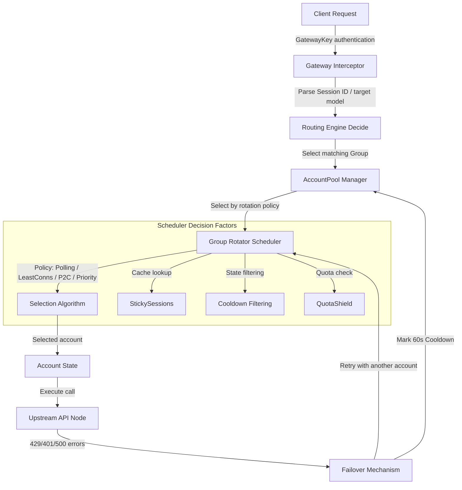

# Simple Sub2API Group Account Rotation Specification

This document defines the design specification and implementation details for group-level account rotation, sticky sessions, health and quota awareness, and automatic failover in `Simple Sub2API`, the minimal personal subscription gateway.

---

## 1. Business Background and Design Goals

As `Simple Sub2API` supports more accounts and subscription sources, purely static or simple sequential selection is no longer enough for personal multi-account use and small-team quota balancing:

1. **Smooth resource balancing**: For individuals with multiple accounts or small teams where quota is unevenly used, the gateway distributes requests across available accounts in a routing group, maximizing utilization and self-adjusting quota balance.
2. **Concurrency-aware dynamic scheduling**: The gateway detects active connections per account and uses Least Connections or P2C scheduling to balance load.
3. **Sticky sessions**: Multi-turn conversations, such as Claude coding tasks or complex reasoning, can keep the same session routed to the same account to improve cache hits and conversation continuity.
4. **Failover and cooldown**: When an account fails because the source password changed, authorization expired, or a temporary server error occurs, the gateway can remove it from selection, place it in cooldown, retry transparently, and switch to another healthy account in the group.
5. **Quota shield**: When an account approaches its quota threshold, the scheduler de-prioritizes or avoids it to prevent one account's sudden exhaustion from interrupting core workflows.

---

## 2. Core Architecture

The group account rotation system follows this call hierarchy:



---

## 3. Config Schema

The `Group` structure in `internal/config/config.go` extends the route group with rotation settings.

### 3.1 Data Structures

```go
type Group struct {
	ID             string              `json:"id"`
	Name           string              `json:"name"`
	Platform       string              `json:"platform"`
	Description    string              `json:"description,omitempty"`
	Status         string              `json:"status"`
	Tags           []string            `json:"tags,omitempty"`
	AccountIDs     []string            `json:"account_ids,omitempty"`
	CreatedAt      string              `json:"created_at"`
	UpdatedAt      string              `json:"updated_at"`
	RotationPolicy GroupRotationPolicy `json:"rotation_policy,omitempty"`
}

type GroupRotationPolicy struct {
	Strategy                 string   `json:"strategy"`
	StickySessionsEnabled    bool     `json:"sticky_sessions_enabled"`
	StickyHeader             string   `json:"sticky_header,omitempty"`
	RetryOnErrors            bool     `json:"retry_on_errors"`
	RotateErrorCodes         []int    `json:"rotate_error_codes,omitempty"`
	CooldownDurationSeconds  int      `json:"cooldown_duration_seconds,omitempty"`
	EnableQuotaProtection    bool     `json:"enable_quota_protection"`
	MinQuotaThresholdPercent float64  `json:"min_quota_threshold_percent,omitempty"`
}
```

### 3.2 Defaults and Validation

`EnsureDefaultsAndSecrets` and `Validate` fill and verify these values:

- **Defaults**:
  - Empty `Strategy` defaults to `"polling"`.
  - Empty `StickyHeader` defaults to `"X-Session-ID"`.
  - Empty `RotateErrorCodes` defaults to `[]int{429, 401, 403, 404, 500}`.
  - `CooldownDurationSeconds == 0` defaults to `60`.
  - `MinQuotaThresholdPercent == 0` defaults to `0.10`.
- **Validation**:
  - `Strategy` must be one of `"polling"`, `"least_connections"`, `"p2c"`, or `"priority"`.
  - `MinQuotaThresholdPercent` must be within `[0.0, 1.0]`.
  - `CooldownDurationSeconds` must be between `0` and `86400` seconds.

---

## 4. Account Selection and Balancing Algorithms

Group account scheduling lives in `internal/accountpool/accountpool.go`. The `Manager` maintains active connection and sticky-session state for advanced scheduling.

### 4.1 Core State Extensions

```go
type Manager struct {
	mu             sync.RWMutex
	monitor        *quota.Monitor
	snapshot       Snapshot
	accounts       map[string]config.Account
	cooldowns      map[string]time.Time
	rr             map[string]int
	seq            uint64
	activeConns    map[string]int
	stickySessions map[string]stickyEntry
}

type stickyEntry struct {
	AccountID string
	ExpiresAt time.Time
}
```

### 4.2 Balancing Algorithms

#### A. Least Connections

Each scheduling decision scans healthy, non-cooldown candidates and selects the account with the smallest `activeConns[accountID]`. Ties are spread by round-robin or randomness to avoid pile-ups.

#### B. P2C (Power of Two Choices)

P2C avoids sending all concurrent threads to the single currently least-loaded account:

1. Randomly select two healthy accounts from the group.
2. Compare their `activeConns` counts.
3. Select the account with fewer active connections. If tied, choose the one with a better historical success rate, or pick randomly.

#### C. Priority / Failover Order

Priority follows the physical order of `AccountIDs` in the group:

- Always try the first healthy account.
- Fall back only when higher-priority accounts are unhealthy, cooling down, or quota-exhausted.

### 4.3 Sticky Sessions

- **Identifier extraction**: The gateway first reads `sticky_header`, such as `X-Session-ID`. If absent, it may use a SHA-256 hash of the `Authorization` token as a fallback.
- **Mapping cache**:
  - If the cache hits and the account remains healthy, without cooldown or exhausted quota, reuse it.
  - If missing or invalid, run the balancing algorithm again, update the sticky cache, and set a TTL of 10-30 minutes.

### 4.4 Quota Awareness and Avoidance

When `EnableQuotaProtection` is enabled, the scheduler reads `quota.AccountQuota`:

- Compute `RemainingRatio = 1.0 - UsageRatio`.
- If `RemainingRatio < MinQuotaThresholdPercent`, lower that account's routing priority.
- Only use protected low-quota accounts when all higher-quota accounts are unavailable, preventing a quota avalanche.

---

## 5. Gateway-Level Automatic Failover Loop

Failover is implemented in `internal/gateway/gateway.go`. Instead of forwarding once and returning `502 Bad Gateway`, the high-availability gateway uses an error-driven rotation loop.

```go
func (h Handler) ServeHTTP(w http.ResponseWriter, r *http.Request) {
    sessionID := extractSessionID(r, group.RotationPolicy.StickyHeader)

    maxAttempts := len(group.AccountIDs)
    if maxAttempts > 3 {
        maxAttempts = 3
    }

    excludedAccounts := make(map[string]bool)

    for attempt := 1; attempt <= maxAttempts; attempt++ {
        chosenAccount, chosenState, err := h.Pool.SelectWithGroupPolicy(decision, group.ID, sessionID, excludedAccounts)
        if err != nil {
            break
        }

        h.Pool.IncrementActiveConn(chosenAccount.ID)
        resp, err := h.forwardToUpstream(r, chosenAccount, body)
        h.Pool.DecrementActiveConn(chosenAccount.ID)

        if err == nil {
            if shouldRotateOnStatusCode(resp.StatusCode, group.RotationPolicy) {
                excludedAccounts[chosenAccount.ID] = true
                h.cooldownAccount(chosenAccount.ID, group.RotationPolicy.CooldownDurationSeconds)
                continue
            }

            h.Pool.UpdateStickySession(sessionID, chosenAccount.ID)
            h.writeResponse(w, resp)
            return
        }

        excludedAccounts[chosenAccount.ID] = true
        h.cooldownAccount(chosenAccount.ID, group.RotationPolicy.CooldownDurationSeconds)
    }

    writeOpenAIError(w, http.StatusServiceUnavailable, "Group pool exhausted", "server_error", "group_exhausted")
}
```

### 5.1 Status Codes That Trigger Rotation

Default rotation codes are:

- `429`: rate limited, switch immediately.
- `401 / 403`: credential invalid or expired, remove from routing.
- `404`: endpoint or model is missing, usually an account-level entitlement issue.
- `500`: upstream internal error, retry with another account for availability.

### 5.2 Fine-Grained Failover and Circuit Breaker

#### A. Dynamic Retry-After Cooldown

For `429` responses with retry guidance, the gateway avoids fixed `60s` cooldowns and parses:

1. `Retry-After` or `X-RateLimit-Reset` headers.
2. Body text such as `"Please try again in 5h23m"` or `"try again after 20 minutes"`.
3. The account is cooled down until the parsed time.

#### B. Weekly Quota Block

When an account's total quota is exhausted:

1. `quota.Monitor` marks the account `StatusExhausted`.
2. The scheduler excludes it from future selection.
3. It rejoins when the natural daily or weekly reset occurs.

#### C. Three-Strike Account Disabling

To prevent bad credentials from consuming retry slots forever:

1. The `accountpool.Manager` keeps `consecutiveFailures map[string]int` in memory.
2. After three consecutive permanent credential failures, such as `401` or `403`, the gateway disables the account in `config.json` and records an error.
3. The account is physically isolated from later scheduling, preserving routing fidelity.

---

## 6. Dashboard Settings Design

The group editor in `frontend/src/views/GroupsView.vue` should include a rotation policy section consistent with the 0xForce high-fidelity UI style.

### 6.1 Frontend State

```typescript
const form = reactive({
  id: '',
  name: '',
  platform: 'openai',
  description: '',
  status: 'active',
  account_ids: [] as string[],
  tags: '',
  strategy: 'polling',
  sticky_sessions_enabled: false,
  sticky_header: 'X-Session-ID',
  retry_on_errors: true,
  rotate_error_codes: '429, 401, 403, 404, 500',
  cooldown_duration_seconds: 60,
  enable_quota_protection: false,
  min_quota_threshold_percent: 10
})
```

### 6.2 UI Layout

The `Edit/Create Group` modal should include an independent card section with rounded borders, subtle gradients, responsive switches, strategy selection, cooldown duration, sticky-session settings, retry status codes, and quota guard thresholds.

---

## 7. Feasibility Analysis

1. **Safe hot updates**: `RotationPolicy` serializes cleanly into the single `config.json` file and remains compatible with optimistic updates.
2. **Lightweight and low-latency**: `activeConns` and `stickySessions` are in-memory `O(1)` operations under locks and add no visible latency.
3. **Aligned with personal-use de-commercialization**: The design contains no billing, user quota splitting, or commercial surfaces. It only improves local account-pool availability and quota balancing.

---

## 8. Verification Plan

### 8.1 Automated Integration Tests

Tests in `internal/accountpool/accountpool_test.go` and `internal/gateway/gateway_test.go` should cover:

- Concurrent scheduling correctness for `least_connections` and `p2c`.
- Sticky sessions with repeated `X-Session-ID` requests.
- Failover when mocked upstream returns `429`.
- Quota threshold skipping when `enable_quota_protection` is enabled.

### 8.2 Manual Dashboard Audit

- Change rotation policy in the Web Dashboard and confirm the saved `config.json` structure.
- Expose `X-Simple-Sub2API-Attempts` in debug responses to show how many rotation attempts occurred.

---

## 9. Reference Source and Alignment Path

- Upstream reference document: `upstream_antigravity_manager_reference.md`, especially Section 4.
- Upstream Rust references:
  1. `reference/Antigravity-Manager/src-tauri/src/proxy/token_manager.rs` for token/account state, active connections, and cooldowns.
  2. `reference/Antigravity-Manager/src-tauri/src/proxy/server.rs` for failover and upstream dispatch.
  3. `reference/Antigravity-Manager/src-tauri/src/proxy/config.rs` for rotation policy structures and validation.
