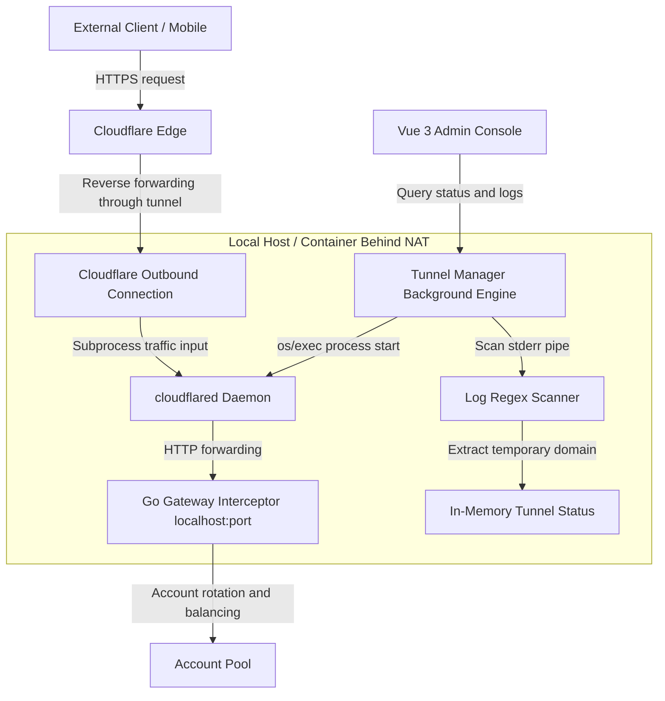

# Simple Sub2API Public Access Tunnel Specification

This document defines the design specification and implementation details for NAT-safe public access in `Simple Sub2API` using **Cloudflare Tunnel (`cloudflared`)**. The feature is designed for personal multi-device workflows and small-team collaboration, allowing a local gateway to be exposed safely without router port forwarding.

---

## 1. Background and Goals

`Simple Sub2API` usually runs on a local physical machine, home NAS, or internal Docker container and often sits behind NAT or multi-layer LAN restrictions. To let office devices, mobile clients, or external IDE assistants call a gateway account pool running at home or inside a LAN, the system needs a highly available public access method:

1. **Secure outbound-only tunnel**: No local TCP/UDP inbound ports are exposed. Cloudflare outbound tunnels establish long-lived connections to edge nodes and isolate the local network from direct public exposure.
2. **Dual tunnel modes**:
   - **Quick Tunnel**: No Cloudflare account or DNS setup is required. Cloudflare generates a temporary public subdomain such as `https://*.trycloudflare.com` for quick testing and personal development.
   - **Named Tunnel**: For long-term use by teams or advanced users. It accepts a Cloudflare Zero Trust Named Tunnel token, binds to the user's own domain, and provides a stable public endpoint.
3. **Automatic HTTPS**: Public access uses HTTPS through Cloudflare Edge, including certificate distribution and renewal.
4. **Gateway visibility and log audit**: The console provides self-healing process monitoring and streams `cloudflared` runtime logs into the Dashboard for troubleshooting and audit.

---

## 2. Core Architecture



---

## 3. Config Schema

Add a dedicated tunnel config structure in `internal/config/config.go`.

### 3.1 Data Structures

```go
type Config struct {
	Server      ServerConfig  `json:"server"`
	Dashboard   DashboardConfig `json:"dashboard"`
	Gateway     GatewayConfig `json:"gateway"`
	GatewayAuth GatewayAuth   `json:"gateway_auth"`
	GatewayKeys []GatewayKey  `json:"gateway_keys"`
	Accounts    []Account     `json:"accounts"`
	Groups      []Group       `json:"groups"`
	Proxies     []ProxyConfig `json:"proxies"`
	Quota       QuotaConfig   `json:"quota"`
	Probe       ProbeConfig   `json:"probe"`
	Metrics     MetricsConfig `json:"metrics"`
	Tunnel      TunnelConfig  `json:"tunnel,omitempty"`
}

type TunnelConfig struct {
	Enabled       bool   `json:"enabled"`
	Mode          string `json:"mode"`
	BinaryPath    string `json:"binary_path,omitempty"`
	Token         string `json:"token,omitempty"`
	LogLimitLines int    `json:"log_limit_lines,omitempty"`
}
```

### 3.2 Defaults and Validation

- **Defaults**:
  - Empty `Mode` defaults to `"quick"`.
  - `LogLimitLines == 0` defaults to `100`.
- **Validation**:
  - `Mode` must be `"quick"` or `"named"`.
  - If `Enabled` is `true` and `Mode` is `"named"`, `Token` must be present and match Cloudflare token expectations.
  - `LogLimitLines` must be between `10` and `1000` to prevent unbounded memory growth.

---

## 4. Tunnel Process Engine

Tunnel lifecycle control lives in `internal/tunnel/tunnel.go`.

### 4.1 Core Structures

```go
package tunnel

type Status string

const (
	StatusStopped   Status = "stopped"
	StatusStarting  Status = "starting"
	StatusConnected Status = "connected"
	StatusError     Status = "error"
)

type RuntimeStatus struct {
	Status       Status   `json:"status"`
	PublicURL    string   `json:"public_url"`
	ErrorMessage string   `json:"error_message,omitempty"`
	ActiveSince  string   `json:"active_since,omitempty"`
	RecentLogs   []string `json:"recent_logs"`
}
```

### 4.2 Process Governance Flow

#### A. Starting the Process

When `Enabled` is `true`, the manager:

1. Reads the local server port from `Config.Server.Bind`, for example `http://127.0.0.1:<port>`.
2. Builds command-line arguments:
   - Quick mode: `cloudflared tunnel --url http://127.0.0.1:<port>`
   - Named mode: `cloudflared tunnel run --token <token>`
3. Starts the subprocess through `os/exec` and attaches stderr to a pipe.

#### B. Public URL Parsing and State Transitions

For Quick Tunnel mode, stderr is scanned for generated `trycloudflare` URLs:

- Regex: `https:\/\/[a-zA-Z0-9-]+\.trycloudflare\.com`
- On start, status becomes `starting`.
- When the URL is found, `PublicURL` is set, status becomes `connected`, and `ActiveSince` is recorded.
- For Named Tunnel mode, logs such as `Registered tunnel connection` or `Route registered` can mark the tunnel connected.

#### C. Self-Healing Supervisor

The supervisor restarts unexpected exits with exponential backoff, capped at 60 seconds, and stops cleanly when requested.

---

## 5. HTTP Endpoints

The admin server adds Dashboard-only routes protected by `adminOnly`.

### 5.1 Get Tunnel Runtime Status

- **Endpoint**: `GET /api/admin/tunnel/status`
- **Auth**: Admin cookie/token.
- **Response**:

```json
{
  "status": "connected",
  "public_url": "https://random-link-example.trycloudflare.com",
  "active_since": "2026-05-23T09:25:00Z",
  "recent_logs": [
    "2026-05-23T09:25:00Z INF Starting tunnel...",
    "2026-05-23T09:25:01Z INF Registered tunnel connection..."
  ]
}
```

### 5.2 Apply Tunnel Config

- **Endpoint**: `POST /api/admin/tunnel/config`
- **Payload**:

```json
{
  "config_version": 4,
  "tunnel": {
    "enabled": true,
    "mode": "quick",
    "binary_path": "",
    "token": "",
    "log_limit_lines": 100
  }
}
```

The backend updates `config.json`, calls `s.updateConfig`, terminates the current `cloudflared` process, and starts a new process using the updated config.

---

## 6. Dashboard Settings Design

Outbound Proxies and Inbound/Public Tunnels both belong to the network connectivity module. The feature is therefore placed in `ProxiesView.vue` with two tabs:

- **Tab 1: Outbound Proxies**: Existing HTTP/SOCKS5 proxy management.
- **Tab 2: Public Access Tunnel**: Cloudflare Tunnel panel, status indicator, configuration parameters, and subprocess log console.

### 6.1 Frontend State

```typescript
const activeTab = ref<'proxies' | 'tunnel'>('proxies')

const tunnelForm = reactive({
  enabled: false,
  mode: 'quick',
  binary_path: '',
  token: '',
  log_limit_lines: 100
})
```

### 6.2 UI Structure

The UI should include tab buttons, a status breathing light, quick/named mode selector, optional `cloudflared` binary path, token field for named mode, connected URL display, copy button, and terminal-style runtime logs.

---

## 7. Feasibility Checks

1. **Hot-load isolation**: `s.updateConfig` locks safely. The old `cloudflared` process is fully terminated and waited on before a new process starts, preventing NAT connection cross-talk.
2. **Zero-dependency quick access**: Quick mode provides out-of-the-box public sharing for developers and personal collaboration.
3. **De-commercialized compliance**: No third-party commercial tunnel server is introduced beyond the user's own local official open-source `cloudflared` process. The feature remains aligned with the personal gateway pool boundary.

---

## 8. Verification Plan

### 8.1 Automated Tests

Tests in `internal/tunnel/tunnel_test.go` should cover:

- Binary existence and missing-binary error reporting.
- Stderr URL regex matching for `https://xxx.trycloudflare.com`.
- Process self-healing after a mocked subprocess exits.

### 8.2 Manual Dashboard and End-to-End Checks

- Start Quick Tunnel in the Dashboard, wait for the status indicator to turn green, copy the URL, and access the admin console from a non-local network.
- Use the public URL with a valid `GatewayKey` to query `/v1/models` and audit concurrency and success rate.

---

## 9. Reference Source and Alignment Path

- Upstream reference document: `upstream_antigravity_manager_reference.md`, Section 6.
- Upstream Rust process manager: `reference/Antigravity-Manager/src-tauri/src/modules/cloudflared.rs`, especially binary detection, quick/named command construction, stderr capture, and state update logic.
