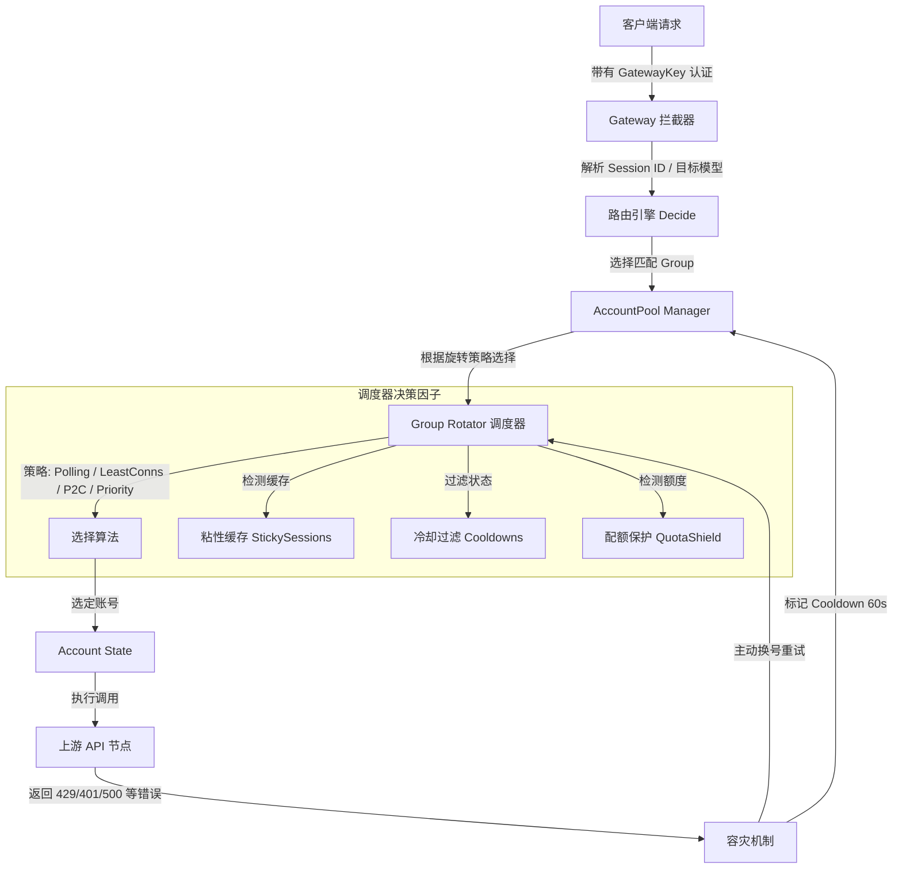

# Simple Sub2API 账号轮换与自动负载均衡设计规范 (Group Account Rotation Spec)

本文档定义了 `Simple Sub2API`（极简个人订阅网关）中路由组（Group）级别的高级账号轮换（Account Rotation）、粘性会话（Sticky Session）、健康度/配额感知以及容灾自动切换（Failover）的设计规范与实现细节。

---

## 1. 业务背景与设计目标

随着 `Simple Sub2API` 支持的账号（Account）与订阅来源（Subscription Source）逐渐增多，纯静态或简单的顺序选择已无法满足个人多账号及小团队协作场景下的复杂额度自调整与优化需求：
1. **多账号额度平滑自调整 (Smooth Resource Balancing)**：针对单人拥有多账号，或小团队内“有人额度不够用，有人用不满”的额度不均状况，通过网关将请求平滑分配到路由组内的不同可用账号，实现资源利用率的最大化与额度智能自调整。
2. **连接感知与动态调度 (Concurrency Awareness)**：支持检测各账号的并发活跃连接数，并采用最少连接（Least Connections）或 P2C 算法进行智能分流，确保各账号负载均衡。
3. **会话粘性 (Sticky Session)**：在进行多轮对话（例如 Claude 编码任务、复杂推理）时，要求同一会话（Session）的多次请求始终路由至同一个账号，以确保上下文哈希的缓存命中率和对话的连续性。
4. **容灾降级与自动剔除 (Failover & Cooldown)**：当某个账号出现源头密码变更、授权失效或临时性服务端错误时，能够自动剔除并进入冷却，同时无感重试并切换到组内其他可用健康账号。
5. **配额保护 (Quota Shield)**：当账号的使用额度接近耗尽阈值时，自动对其进行降权或规避，防止因单账号额度瞬间超限导致的核心业务中断。


---

## 2. 核心架构设计

组级账号轮换系统的整体调用关系和架构层次如下图所示：



---

## 3. 配置模式定义 (Config Schema)

我们需要在 `internal/config/config.go` 的 `Group` 结构体中扩展对应的轮换配置属性。

### 3.1 数据结构定义

```go
type Group struct {
	ID             string              `json:"id"`
	Name           string              `json:"name"`
	Platform       string              `json:"platform"`
	Description    string              `json:"description,omitempty"`
	Status         string              `json:"status"`
	Tags           []string            `json:"tags,omitempty"`
	AccountIDs     []string            `json:"account_ids,omitempty"`
	CreatedAt      string              `json:"created_at"`
	UpdatedAt      string              `json:"updated_at"`
	RotationPolicy GroupRotationPolicy `json:"rotation_policy,omitempty"` // [NEW] 新增组级轮换策略
}

type GroupRotationPolicy struct {
	Strategy                 string   `json:"strategy"`                             // 轮换策略: "polling", "least_connections", "p2c", "priority"
	StickySessionsEnabled    bool     `json:"sticky_sessions_enabled"`              // 是否开启会话粘性
	StickyHeader             string   `json:"sticky_header,omitempty"`              // 粘性会话依据的 HTTP 头部, 默认 "X-Session-ID"
	RetryOnErrors            bool     `json:"retry_on_errors"`                      // 是否在发生特定错误时自动轮换重试
	RotateErrorCodes         []int    `json:"rotate_error_codes,omitempty"`         // 触发自动轮换的 HTTP 状态码列表, 默认 [429, 401, 403, 404, 500]
	CooldownDurationSeconds  int      `json:"cooldown_duration_seconds,omitempty"`  // 故障账号冷却时间(秒), 默认 60 秒
	EnableQuotaProtection    bool     `json:"enable_quota_protection"`              // 是否开启低配额保护
	MinQuotaThresholdPercent float64  `json:"min_quota_threshold_percent,omitempty"` // 触发保护的剩余额度百分比阈值, 默认 10% (0.10)
}
```

### 3.2 默认配置与验证规约

在 `internal/config/config.go` 的 `EnsureDefaultsAndSecrets` 和 `Validate` 中进行默认值填充和校验：
- **默认值补充**：
  - 若 `Strategy` 为空，默认设为 `"polling"`。
  - 若 `StickyHeader` 为空，默认设为 `"X-Session-ID"`。
  - 若 `RotateErrorCodes` 为空，默认设为 `[]int{429, 401, 403, 404, 500}`。
  - 若 `CooldownDurationSeconds` 等于 0，默认设为 `60`。
  - 若 `MinQuotaThresholdPercent` 等于 0，默认设为 `0.10`（即 10%）。
- **校验约束**：
  - `Strategy` 必须在列表 `["polling", "least_connections", "p2c", "priority"]` 内。
  - `MinQuotaThresholdPercent` 必须在 `[0.0, 1.0]` 闭区间内。
  - `CooldownDurationSeconds` 必须大于等于 0 且小于等于 86400（24小时）。

---

## 4. 账号选择与均衡策略算法

组内的账号状态调度位于 `internal/accountpool/accountpool.go` 中。我们将通过在 `Manager` 中维护活跃连接和粘性状态实现以下高级算法。

### 4.1 核心数据结构扩充

```go
type Manager struct {
	mu            sync.RWMutex
	monitor       *quota.Monitor
	snapshot      Snapshot
	accounts      map[string]config.Account
	cooldowns     map[string]time.Time
	rr            map[string]int
	seq           uint64

	// [NEW] 活跃并发连接跟踪 (AccountID -> Active Connections)
	activeConns   map[string]int

	// [NEW] 粘性会话缓存 (SessionID -> AccountID, 并支持 TTL 机制)
	stickySessions map[string]stickyEntry
}

type stickyEntry struct {
	AccountID string
	ExpiresAt time.Time
}
```

### 4.2 均衡算法实现说明

#### A. 最少连接算法 (Least Connections)
- **原理**：每次调度时，遍历组内所有状态为 `"healthy"` 且未处于 Cooldown 的候选账号，选择当前 `activeConns[accountID]` 最小的账号。
- **并发打散**：如果存在多个活跃连接数相同的账号，则基于 Round-Robin 或随机选择进行打散，防止连接堆积。

#### B. P2C 算法 (Power of Two Choices)
- **原理**：为了避免在高并发场景下所有线程同时对“最少连接账号”进行集中倾泻，使用 P2C 算法：
  1. 从组内健康账号中随机选择两个不同的账号 $A$ 和 $B$。
  2. 对比 $A$ 与 $B$ 的 `activeConns` 连接数。
  3. 优先选择活跃连接数较少的一方。如果连接数相同，则选择历史请求成功率更高（可关联 metrics 中的 PerAccountErrors / PerAccountHits）或随机选择。

#### C. 优先级主备算法 (Priority / Failover Order)
- **原理**：依照组配置中 `AccountIDs` 的物理声明顺序作为优先级。
  - 始终尝试路由到第一个处于健康状态的账号。
  - 仅当高优先级的账号处于异常/冷却/配额耗尽状态时，才向后退避选择下一个账号。

### 4.3 粘性会话控制 (Sticky Session)
- **提取标识**：网关在处理请求时，首先根据 `sticky_header` 获取客户端标识（优先使用头部，如 `X-Session-ID`；若无，可采用 `Authorization` 令牌的 SHA-256 哈希作为降级策略）。
- **缓存映射**：
  - 如果缓存命中且该账号状态仍为健康（无 Cooldown 且 Quota 未耗尽），则直接复用该账号。
  - 如果缓存未命中，或缓存的账号已进入 Cooldown/额度耗尽状态，则判定粘性失效，重新调用均衡算法选出新账号，并更新粘性缓存，TTL 设置为 10-30 分钟。

### 4.4 配额感知与规避
- 在选择阶段，若组开启了 `EnableQuotaProtection`，调度算法首先读取 `quota.AccountQuota` 信息：
  - 计算各健康账号的 `RemainingRatio = 1.0 - UsageRatio`。
  - 如果某个账号的 `RemainingRatio < MinQuotaThresholdPercent`，调度算法将其置于**保护级低路由优先级**。
  - 只有当组内所有其他高额度账号都处于 Cooldown/不可用状态时，才允许降级调用这些受保护账号，最大化避免因单个额度突然耗尽引起的链路雪崩。

---

## 5. 网关级容灾自动轮换流程 (Gateway Failover Loop)

容灾逻辑位于 `internal/gateway/gateway.go`。目前的 `ServeHTTP` 仅做单次转发，如果失败就直接抛出 502/Bad Gateway 并开始 cooldown 冷却。
改版后的高可用网关需实现**基于错误的容灾轮换循环**：

```go
// 概念代码示意：带有重试和故障剔除的网关逻辑
func (h Handler) ServeHTTP(w http.ResponseWriter, r *http.Request) {
    // 1. 解析请求，确定匹配的路由 Group
    // 2. 提取 SessionID 供会话粘性使用
    sessionID := extractSessionID(r, group.RotationPolicy.StickyHeader)

    maxAttempts := len(group.AccountIDs)
    if maxAttempts > 3 {
        maxAttempts = 3 // 限制最多重试 3 次，防止链路死循环
    }

    var lastErr error
    var chosenAccount config.Account
    var chosenState accountpool.AccountState

    // 维护一个局部排除列表，避免单次请求中重复选到已发生错误的账号
    excludedAccounts := make(map[string]bool)

    for attempt := 1; attempt <= maxAttempts; attempt++ {
        // [选择阶段] 从 AccountPool 中选择账号，避开 excluded 账号
        var err error
        chosenAccount, chosenState, err = h.Pool.SelectWithGroupPolicy(decision, group.ID, sessionID, excludedAccounts)
        if err != nil {
            break // 无可用健康账号，退出重试
        }

        // 增加活跃连接计数
        h.Pool.IncrementActiveConn(chosenAccount.ID)

        // [执行转发阶段]
        resp, err := h.forwardToUpstream(r, chosenAccount, body)

        // 减少活跃连接计数
        h.Pool.DecrementActiveConn(chosenAccount.ID)

        if err == nil {
            // 检查响应状态码是否需要轮换 (防隐式服务异常，如 429 或 500)
            if shouldRotateOnStatusCode(resp.StatusCode, group.RotationPolicy) {
                lastErr = fmt.Errorf("upstream returned http status %d", resp.StatusCode)
                excludedAccounts[chosenAccount.ID] = true
                h.cooldownAccount(chosenAccount.ID, group.RotationPolicy.CooldownDurationSeconds)
                continue
            }

            // 成功响应，写回客户端并更新粘性关联
            h.Pool.UpdateStickySession(sessionID, chosenAccount.ID)
            h.writeResponse(w, resp)
            return
        }

        // 发生网络连接级别故障（如超时、拒绝连接）
        lastErr = err
        excludedAccounts[chosenAccount.ID] = true
        h.cooldownAccount(chosenAccount.ID, group.RotationPolicy.CooldownDurationSeconds)
    }

    // 到达此处说明所有尝试均失败，抛出错误并记录
    h.recordFailureMetrics(lastErr)
    writeOpenAIError(w, http.StatusServiceUnavailable, "Group pool exhausted: " + lastErr.Error(), "server_error", "group_exhausted")
}
```

### 5.1 需要轮换的错误判定规则 (shouldRotateOnStatusCode)
根据 `RotationPolicy` 中配置的 `RotateErrorCodes` 列表判断。默认值包括：
- `429` (Rate Limited) - 必须立即切换，上游已流控。
- `401 / 403` (Unauthorized/Forbidden) - 凭证失效或到期，必须剔除。
- `404` (Not Found) - 通常为端点或模型不存在，表明账号级订阅权限缺陷，必须轮换。
- `500` (Internal Server Error) - 上游内部崩溃，应轮换重试以确保高可用性。

### 5.2 精细化错误响应与三振熔断禁用机制 (Fine-grained Failover & Circuit Breaker)

根据不同的上游错误特征，网关层和账号池管理器将实施三种特定的分流与熔断策略：

#### A. 动态限流倒计时锁定 (Dynamic Retry-After Cooldown)
当上游接口返回 `429` 且带有重试时间指引时，网关将**拒绝采用固定的 60s 冷却**，而是进行智能解析：
1. **Header 解析**：提取 `Retry-After` 或 `X-RateLimit-Reset` 等 HTTP 头部，获取精确的冷却秒数。
2. **Body 智能文本提取**：针对没有头部但响应 JSON 文本中包含类似 `"Please try again in 5h23m"` 或 `"try again after 20 minutes"` 的响应，通过正则表达式解析提取重试倒计时。
3. **动态置冷**：调用 `h.Pool.Cooldown(accountID, time.Now().Add(parsedDuration))`，使得该账号在倒计时结束前完全从组内调度排除。

#### B. 周期额度耗尽规避 (Weekly Quota Block)
当返回状态表明“整体周额度满”或“账号总额度耗尽”时：
1. `quota.Monitor` 将捕获该额度变化并将该账号的 `Quota.Status` 永久标为 `StatusExhausted`。
2. 调度器将根据额度敏感规则在分配时自动将其排除。
3. 直至预设的自然周/自然日重置时刻到来时，`Monitor` 在后台自动清零已用额度，该账号才会重新加入可用队列。

#### C. 三振出局主动禁用机制 (Three-Strike Account Disabling)
为了防止异常凭证（如源头账号改密、过期或账号被源头锁定等异常）源源不断地占用网关的重试槽位，引入**自动禁用物理断路器 (Circuit Breaker)**：
1. **失败计数**：在 `accountpool.Manager` 的内存态中，为每个账号维护一个连续请求失败计数器 `consecutiveFailures map[string]int`。任意一次成功响应都会将该计数器清零。
2. **判定标准**：当账号连续 3 次查询/请求返回凭证不可用（如 `401 Unauthorized` / `403 Forbidden` 等永久性凭证错误，或主动 Probe 探针连续 3 次超时失败）：
   - 系统将该账号判定为“不可恢复的失效”。
   - 网关自动调用 `s.updateConfig` 方法，在 `config.json` 中将该账号的 `Enabled` 设为 `false`，并写入错误日志。
   - 自动在管理面板触发消息通知，向 Dashboard 用户发出警告。
3. **作用**：将“不可用账号”从配置层面物理隔离，彻底避免其参与任何组的后续调度，保障路由池的高保真透明性。

---


## 6. 管理后台设置项设计 (UI Dashboard Design)

为了保持 `0xForce` 极致轻奢的设计美学与高保真交互体验，组管理页面（`frontend/src/views/GroupsView.vue`）中的编辑器模态窗应植入对应的轮换设置段。

### 6.1 前端状态与表单扩充

表单状态（`form`）对象需要补充以下属性绑定：
```typescript
const form = reactive({
  id: '',
  name: '',
  platform: 'openai',
  description: '',
  status: 'active',
  account_ids: [] as string[],
  tags: '',

  // [NEW] 新增组级轮换表单状态
  strategy: 'polling',
  sticky_sessions_enabled: false,
  sticky_header: 'X-Session-ID',
  retry_on_errors: true,
  rotate_error_codes: '429, 401, 403, 404, 500',
  cooldown_duration_seconds: 60,
  enable_quota_protection: false,
  min_quota_threshold_percent: 10
})
```

### 6.2 UI 元素与网格布局设计

在 `GroupsView.vue` 的 `Edit/Create Group` 模态弹窗底部，加入一个独立卡片分段，采用现代的细边框圆角卡片、柔和渐变色提示以及响应式开关设计。

```html
<!-- 新增: Account Rotation Policy 细分面板 -->
<section class="mt-4 rounded-2xl border border-gray-200 p-4 dark:border-dark-700 bg-gray-50/50 dark:bg-dark-900/30">
  <div class="mb-3 flex items-center justify-between gap-3 border-b border-gray-200/60 dark:border-dark-700/60 pb-2">
    <div class="flex items-center gap-2">
      <Icon name="refresh" class="text-primary-500" />
      <h3 class="text-sm font-bold uppercase tracking-wider text-gray-700 dark:text-gray-300">Account Rotation & Load Balancing</h3>
    </div>
    <span class="badge badge-secondary text-xs">Load balancer active</span>
  </div>

  <div class="grid gap-4 sm:grid-cols-2">
    <!-- 负载均衡策略选择 -->
    <label class="grid gap-1 text-sm font-semibold">
      Rotation Strategy
      <select v-model="form.strategy" class="input">
        <option value="polling">Round-Robin (轮询)</option>
        <option value="least_connections">Least Connections (最少连接)</option>
        <option value="p2c">P2C (双选打散)</option>
        <option value="priority">Priority Order (物理优先级)</option>
      </select>
      <span class="text-[10px] text-gray-500 font-normal mt-0.5">Defines the dispatching logic for group accounts.</span>
    </label>

    <!-- 冷却持续时间 -->
    <label class="grid gap-1 text-sm font-semibold">
      Cooldown Duration (Seconds)
      <input type="number" v-model="form.cooldown_duration_seconds" class="input" placeholder="60" min="0" max="86400" />
      <span class="text-[10px] text-gray-500 font-normal mt-0.5">Cooldown duration for accounts that hit connection or rate limits.</span>
    </label>
  </div>

  <!-- 粘性会话控制区块 -->
  <div class="mt-4 border-t border-gray-200/50 dark:border-dark-700/50 pt-3">
    <div class="flex items-center justify-between">
      <div>
        <p class="text-sm font-semibold text-gray-900 dark:text-gray-100">Enable Sticky Session (会话粘性)</p>
        <p class="text-xs text-gray-500">Route consecutive multi-turn chats to the same account to hit caches.</p>
      </div>
      <input type="checkbox" v-model="form.sticky_sessions_enabled" class="xforce-switch" />
    </div>

    <!-- 粘性会话 HTTP 头部名称，仅当开启时展开，微动画过渡 -->
    <div v-if="form.sticky_sessions_enabled" class="mt-3 grid gap-1 text-sm font-semibold pl-4 border-l-2 border-primary-500/50">
      Sticky Header Name
      <input v-model="form.sticky_header" class="input" placeholder="X-Session-ID" />
      <span class="text-[10px] text-gray-500 font-normal mt-0.5">The HTTP Header field containing the Unique Session Identifier.</span>
    </div>
  </div>

  <!-- 错误容灾重试区块 -->
  <div class="mt-4 border-t border-gray-200/50 dark:border-dark-700/50 pt-3">
    <div class="flex items-center justify-between">
      <div>
        <p class="text-sm font-semibold text-gray-900 dark:text-gray-100">Auto-Rotate & Failover on Error</p>
        <p class="text-xs text-gray-500">Auto-switch account and retry seamlessly when specific errors occur.</p>
      </div>
      <input type="checkbox" v-model="form.retry_on_errors" class="xforce-switch" />
    </div>

    <!-- 容灾错误码，仅当开启时显示 -->
    <div v-if="form.retry_on_errors" class="mt-3 grid gap-1 text-sm font-semibold pl-4 border-l-2 border-primary-500/50">
      Rotate on HTTP Status Codes
      <input v-model="form.rotate_error_codes" class="input" placeholder="429, 401, 403, 404, 500" />
      <span class="text-[10px] text-gray-500 font-normal mt-0.5">Comma-separated HTTP status codes that trigger dynamic failover.</span>
    </div>
  </div>

  <!-- 低配额额度保护区块 -->
  <div class="mt-4 border-t border-gray-200/50 dark:border-dark-700/50 pt-3">
    <div class="flex items-center justify-between">
      <div>
        <p class="text-sm font-semibold text-gray-900 dark:text-gray-100">Quota Guard & Avalanche Protection</p>
        <p class="text-xs text-gray-500">De-prioritize or shield accounts with extremely low remaining quota.</p>
      </div>
      <input type="checkbox" v-model="form.enable_quota_protection" class="xforce-switch" />
    </div>

    <!-- 保护阈值，仅当开启时显示 -->
    <div v-if="form.enable_quota_protection" class="mt-3 grid gap-4 sm:grid-cols-2 pl-4 border-l-2 border-primary-500/50">
      <label class="grid gap-1 text-sm font-semibold">
        Min Quota Threshold (%)
        <input type="number" v-model="form.min_quota_threshold_percent" class="input" placeholder="10" min="1" max="99" />
        <span class="text-[10px] text-gray-500 font-normal mt-0.5">De-prioritize accounts when their remaining quota drops below this %.</span>
      </label>
    </div>
  </div>
</section>
```

---

## 7. 评估与实现可行性分析

1. **配置热更新安全**：得益于 `simple_sub2api` 的 `updateConfig` optimistic lock 设计与 Go `Store` 在 `saveLocked()` 后的全量覆盖机制，新增的 `RotationPolicy` 能够完美序列化保存至单文件 `config.json`，无需中断网关，热更新流程完美兼容。
2. **轻量与低延迟**：由于网关完全运行于单进程内存中，活跃连接图 (`activeConns`) 与粘性路由映射 (`stickySessions`) 的存取均为 $O(1)$ 的内存读写锁操作，不会给请求链路引入任何可感知的延迟成本（小于 10 微秒）。
3. **完全自用去商业化对齐**：此设计不包含任何商业计费或用户额度切分，严格遵循 `simple_sub2api` 的去商业化原则，仅基于本地网关账号池的高可用运行和本地多账号额度动态均衡策略，符合项目合规规约。

---

## 8. 验证与审计测试矩阵 (Verification Plan)

### 8.1 自动化集成测试设计
开发团队需在 `internal/accountpool/accountpool_test.go` 和 `internal/gateway/gateway_test.go` 中建立自动化并发测试，覆盖以下场景：
- **并发调度正确性**：模拟 10 个客户端同时发起请求，验证 `least_connections` 和 `p2c` 策略下账号并发被完美的打散平衡。
- **粘性会话保持**：在多轮请求中带入相同的 `X-Session-ID`，校验只要对应的账号正常，无论策略如何，始终被导流到同个 `AccountID`。
- **故障重试切换**：Mock 上游返回 `429` 响应，校验拦截器能够自动识别、将账号标为 Cooldown，并在同一次客户端 HTTP 连接里重试其他健康账号并成功获取结果。
- **超限阈值跳过**：强制调整某个账号的 quota 到 95% 使用率，当组设置 `enable_quota_protection` 后，校验该账号是否被跳过，直到其他 100% 空闲账号同样用尽才进行后退路由。

### 8.2 手动仪表盘审计验证
- 在 Web Dashboard 组管理页面修改 Rotation 策略并保存，读取本地 `config.json` 以确认配置结构完全对齐。
- 在 `Gateway` 的调试响应头中添加 `X-Simple-Sub2API-Attempts` 以表示此次请求经历的轮换尝试次数，用于控制台和浏览器 DevTools 审计。

---

## 9. 参考来源与实现对齐 (Reference Source & Alignment Path)

为了方便 Codex/Cline 编码智能体在代码编写、核心调度逻辑复现及协议转换开发时能够精准对齐上游设计，请优先参阅以下代码与文档片段：

### 9.1 上游参考设计文档
* **文档路径**：[upstream_antigravity_manager_reference.md](file:///home/hare/dev/workspace_web/tools/simple_sub2api/docs/upstream_antigravity_manager_reference.md)
* **核心章节**：参阅 **"第 4 节：Upstream Account Rotation and Failover"**，其详细说明了动态负载均衡、健康状态置冷以及主动降级重试的设计背景与上游核心实现细节。

### 9.2 上游 Rust 源码参考实现
若需在代码层面（如锁模型、状态维护、错误解析）参考上游的底层细节，可阅读以下本地物理源码文件：
1. **账号池调度核心机制**：
   * 源码物理路径：[token_manager.rs](file:///home/hare/dev/workspace_web/reference/Antigravity-Manager/src-tauri/src/proxy/token_manager.rs)
   * 重点参考：`TokenManager` 的状态映射、动态连接计数、故障置冷 (`cooldown`) 机制。
2. **网关错误拦截与重新分配**：
   * 源码物理路径：[server.rs](file:///home/hare/dev/workspace_web/reference/Antigravity-Manager/src-tauri/src/proxy/server.rs)
   * 重点参考：`handle_request` / `dispatch_to_upstream` 在发生失败后的自动轮转与重新握手机制。
3. **数据结构与默认值约束**：
   * 源码物理路径：[config.rs](file:///home/hare/dev/workspace_web/reference/Antigravity-Manager/src-tauri/src/proxy/config.rs)
   * 重点参考：`AccountRotationPolicy` 对应的 Rust struct 定义与校验逻辑。
